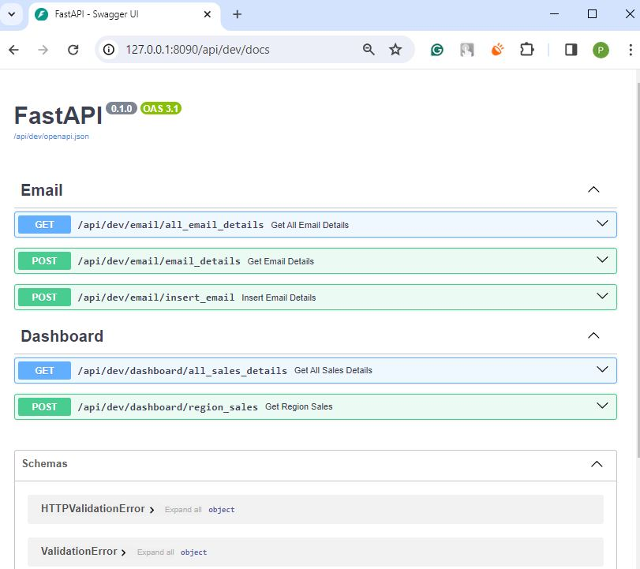

## 1. [Download PostgreSQL](https://www.enterprisedb.com/postgresql-tutorial-resources-training-2?uuid=d0ed4d28-191f-4273-b6a9-427ab0b4c448&campaignId=Product_Trial_PostgreSQL_15)

## 2. Prepare Environment
-   ### python -m venv venv
-   ### pip install -r .\requirements.txt

## 3. Create Database Table & Insert Data
-   ### run `setup_database.py` file

## 4. The same application has been developed using `.include_router` & `.mount`. Now open any folder and run `main.py` file.

## 5. Screenshot
-   ### .include_router

-   ### .mount - email

-   ### .mount - dashboard

